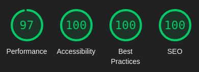

# Code 200 Portfolio
A developer's portfolio, with a clean design, responsive,easily customizable and with localization.
All without any JavaScript framework and statically generated!



## Install

Simply clone the project and start editing:

```
git clone git@github.com:code200fr/devportfolio.git
cd devportfolio
npm i
npm run build
num run watch & npm run serve && fg
```

## How to edit

### Content
To change the content of the site, edit the `etc/settings.json` file.
All the description of the configuration is available here:
https://github.com/code200fr/devportfolio/blob/main/src/Settings.ts

### Localization
To add a locale to your portfolio, add a file in ISO.json format (e.g. `en.json`, `es.json`),
and add the ISO in the `etc/settings.json` file, at the `locales` property.

The locale settings are based on `settings.json` and merged,
so you only have to update or translate what changes.

### Style & Medias
To change the site's CSS, edit the file `assets/style.css`.
It was designed so that the theme can be easily changed via CSS variables.

To add images or videos, simply put them in the `assets/` folder,
they will be copied at compile time.

## Commands
* `npm run build`: compiles the generator. *You should only have to run this one once.*
* `npm run watch`: watch changes you make and update the `generated/` directory accordingly
* `npm run serve`: starts a local server with your static website.

## Directory structure
* `assets/`: css files, images
* `etc/`: configuration & i18n json files
* `scripts/`: frontend typescript files
* `src/`: generator typescript source files ("backend")
* `views/`: nunjucks views

The following directories will be created:
* `build/`: generator javascript compiled code
* **`generated/`: the static website, ready. This is the folder you should deploy on your hosting service**
* `node_modules/`: you know that one

## Licence
MIT